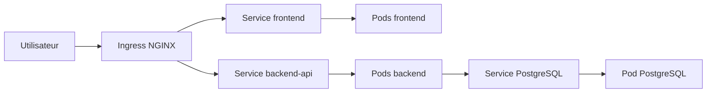
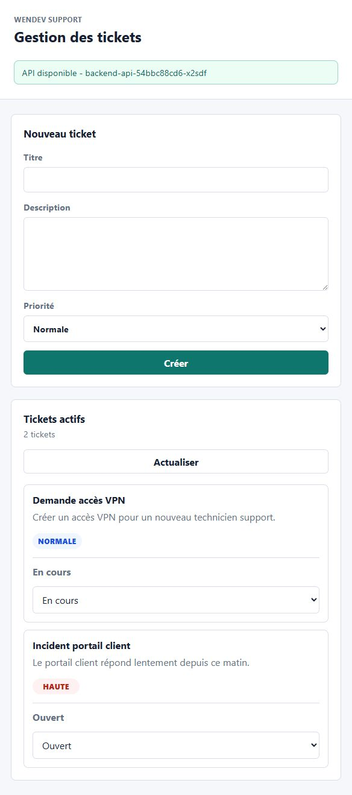

# Mise en place d'une solution de conteneurisation avec Kubernetes

Projet PFA - 4ème année ISI  
Entreprise fictive : Wendev  
Application de démonstration : Wendev Tickets

<!-- Notes : Présenter le sujet comme un projet d'infrastructure et non seulement comme une application web. -->

---

# Contexte

Wendev dispose d'applications installées de manière classique sur des serveurs ou machines virtuelles.

Limites observées :

- dépendance forte entre application et serveur ;
- déploiements manuels ;
- faible tolérance aux pannes ;
- scalabilité difficile ;
- supervision et maintenance complexes.

<!-- Notes : Faire le lien avec ce que le professeur a demandé : étude de l'existant, critique, puis solution Kubernetes. -->

---

# Problématique

Comment moderniser l'hébergement applicatif de Wendev afin d'améliorer :

- la disponibilité ;
- la redondance ;
- l'exposition des applications ;
- l'automatisation du déploiement ;
- la capacité à faire évoluer les services.

<!-- Notes : Insister sur le fait que le problème n'est pas seulement de lancer un conteneur, mais de gérer plusieurs conteneurs dans le temps. -->

---

# Solution proposée

La solution retenue est :

```text
Docker + Kubernetes
```

Docker permet de créer les images applicatives.  
Kubernetes orchestre les conteneurs, les Services, les replicas, l'exposition et la reprise après incident.

<!-- Notes : Expliquer que Docker seul ne suffit pas dès que le nombre de conteneurs augmente. -->

---

# Application de démonstration

Application : gestion de tickets/incidents.

Composants :

- frontend web ;
- backend API ;
- base de données PostgreSQL.

Flux :

```text
Utilisateur -> Ingress -> Frontend -> Backend API -> PostgreSQL
```

<!-- Notes : L'application est simple volontairement pour garder le projet centré sur Kubernetes. -->

---

# Architecture Kubernetes cible



<!-- Notes : Le point important est la séparation entre accès externe, Services internes et Pods. -->

---

# Cluster local

Cluster `kind` :

- 1 nœud Control Plane ;
- 2 worker nodes ;
- environnement Windows 10 + Docker Desktop + WSL 2 ;
- accès HTTP via Ingress local sur `http://127.0.0.1:8080`.

Commande de preuve :

```powershell
kubectl get nodes -o wide
```

<!-- Notes : Expliquer que kind sert à apprendre et valider localement avant le cloud. -->

---

# Objets Kubernetes utilisés

Objets principaux :

- Namespace `wendev` ;
- ConfigMap ;
- Secret ;
- StatefulSet PostgreSQL ;
- Deployments frontend et backend ;
- Services `ClusterIP` ;
- Ingress NGINX ;
- HPA optionnel.

<!-- Notes : Ne pas détailler tout le YAML, expliquer le rôle de chaque famille d'objet. -->

---

# Déploiement applicatif

Images Docker :

```text
wendev-tickets-frontend:local
wendev-tickets-backend:local
```

Déploiement Kubernetes :

```powershell
kubectl apply -f k8s
kubectl get deploy -n wendev -o wide
```

Résultat attendu :

```text
backend-api   3/3
frontend      2/2
```

---

# Services et exposition

Services internes :

```powershell
kubectl get svc -n wendev
```

```text
backend-api   ClusterIP   3000/TCP
frontend      ClusterIP   80/TCP
postgres      ClusterIP   5432/TCP
```

Ingress :

```powershell
kubectl get ingress -n wendev
```

```text
wendev-tickets   nginx   localhost   80
```

<!-- Notes : Le Service donne une adresse stable aux Pods, l'Ingress donne un point d'entrée HTTP. -->

---

# Application accessible

URL de démonstration :

```text
http://127.0.0.1:8080
```

Tests :

```powershell
curl.exe http://127.0.0.1:8080/health
curl.exe http://127.0.0.1:8080/api/health
```

Résultat attendu :

```text
ok
database connected
```

<!-- Notes : Ouvrir l'interface web et créer un ticket pour montrer que le chemin complet fonctionne. -->

---

# Preuve visuelle



<!-- Notes : Montrer que ce n'est pas seulement un déploiement théorique, l'application fonctionne dans le navigateur. -->

---

# Auto-réparation

Test :

```powershell
kubectl get pods -n wendev -o wide
kubectl delete pod <nom-du-pod-backend> -n wendev
kubectl get pods -n wendev -o wide
```

Observation :

- l'ancien Pod passe en `Terminating` ;
- un nouveau Pod backend est créé ;
- l'API reste disponible via Ingress.

<!-- Notes : C'est le moment le plus important de la démonstration. -->

---

# Scaling manuel

Réduction :

```powershell
kubectl scale deployment backend-api -n wendev --replicas=2
kubectl get deploy backend-api -n wendev -o wide
```

Retour à trois replicas :

```powershell
kubectl scale deployment backend-api -n wendev --replicas=3
kubectl rollout status deployment/backend-api -n wendev --timeout=120s
```

<!-- Notes : Expliquer que Kubernetes ajuste automatiquement le nombre de Pods pour atteindre l'état demandé. -->

---

# Haute disponibilité démontrée

Dans cette version locale :

- frontend répliqué ;
- backend répliqué ;
- Services stables ;
- Ingress fonctionnel ;
- recréation automatique des Pods ;
- scaling manuel validé.

Limite assumée :

PostgreSQL reste en une seule instance dans la démonstration locale.

<!-- Notes : Dire clairement qu'en production, la base de données doit être managée ou hautement disponible. -->

---

# Passage vers Azure

Prochaine évolution possible :

- pousser le projet sur GitHub ;
- construire les images dans un registry ;
- déployer sur Azure Kubernetes Service ;
- exposer l'application avec un LoadBalancer Azure ou un Ingress Controller ;
- utiliser une base PostgreSQL managée.

<!-- Notes : GitHub sert à la traçabilité et facilite l'automatisation future. -->

---

# Conclusion

Ce projet montre le passage :

```text
Serveurs applicatifs classiques
        vers
Applications conteneurisées orchestrées par Kubernetes
```

Apports démontrés :

- conteneurisation ;
- orchestration ;
- redondance ;
- exposition via Ingress ;
- auto-réparation ;
- scaling.

<!-- Notes : Terminer en disant que l'objectif principal était d'apprendre Kubernetes par la pratique. -->

