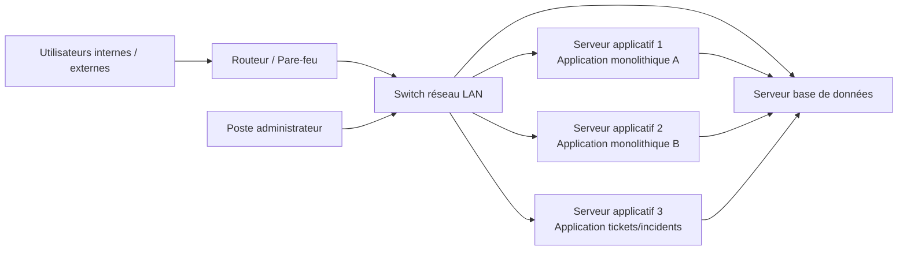
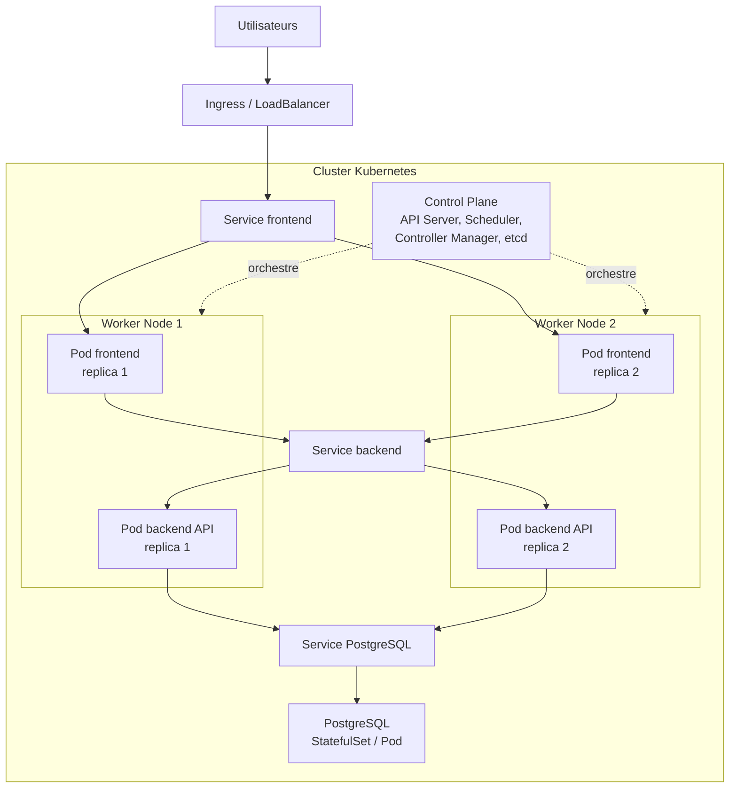
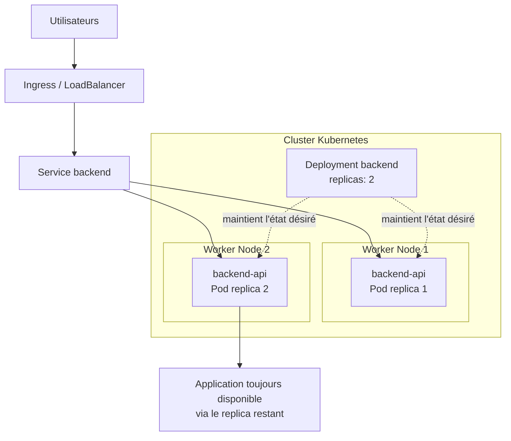
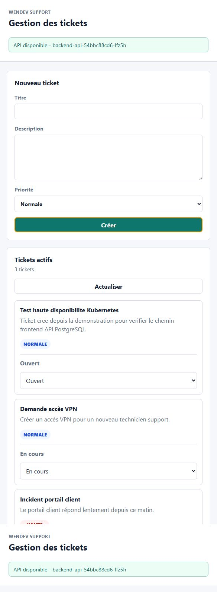
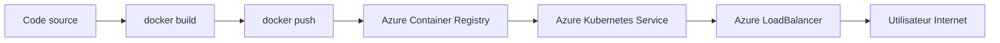
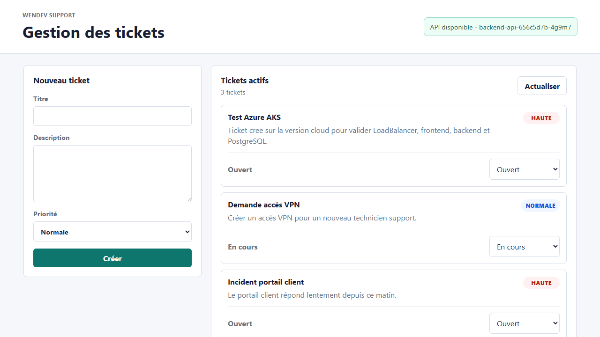

# Mise en place d'une solution de conteneurisation avec Kubernetes

## Page de garde

| Élément | Valeur |
| --- | --- |
| Filière | 4ème année - Ingénierie des Systèmes d'Information |
| Année universitaire | 2025-2026 |
| Sujet | Mise en place d'une solution de conteneurisation avec Kubernetes |
| Encadrant | M. Mohamed Amine ESSFALI |
| Entreprise étudiée | Wendev, entreprise fictive |
| Application support | Wendev Tickets |
| Auteur | Amine |

## Résumé

Ce projet porte sur la mise en place d'une solution de conteneurisation et d'orchestration basée sur Kubernetes. Il part d'un scénario d'entreprise fictive, Wendev, disposant d'applications monolithiques installées sur des serveurs ou machines virtuelles. Cette architecture présente des limites en matière de disponibilité, de scalabilité, d'automatisation et de maîtrise des déploiements.

La solution proposée consiste à conteneuriser une application de démonstration avec Docker, puis à la déployer sur Kubernetes. Une première mise en œuvre locale a été réalisée avec Docker Desktop, WSL 2, kind et kubectl. Elle permet de démontrer les notions essentielles : Pods, Deployments, Services, Ingress, ConfigMaps, Secrets, replicas, scaling manuel et auto-réparation. Une seconde mise en œuvre a ensuite été réalisée sur Azure Kubernetes Service afin de valider l'exposition publique via un LoadBalancer cloud et l'utilisation d'Azure Container Registry.

L'application support, Wendev Tickets, reste volontairement simple afin que le cœur du projet soit l'apprentissage et la démonstration de Kubernetes. Elle est composée d'un frontend, d'une API backend et d'une base de données PostgreSQL.

**Mots-clés :** Kubernetes, Docker, conteneurisation, orchestration, haute disponibilité, LoadBalancer, Ingress, AKS, Azure Container Registry.

## Table des matières

1. Introduction générale
2. Chapitre 1 - Étude de l'existant et problématique
3. Chapitre 2 - Conduite du projet et étude comparative
4. Chapitre 3 - Architecture Kubernetes proposée
5. Chapitre 4 - Mise en œuvre locale
6. Chapitre 5 - Déploiement cloud sur Azure AKS
7. Tests, résultats et validation
8. Limites et perspectives
9. Conclusion générale
10. Bibliographie
11. Annexes

## Liste des figures

| Figure | Description | Source |
| --- | --- | --- |
| Figure 1 | Architecture existante monolithique | `diagrams/existant_monolithique.mmd` |
| Figure 2 | Architecture cible Kubernetes | `diagrams/architecture_cible_kubernetes.mmd` |
| Figure 3 | Flux de déploiement Docker vers Kubernetes | `diagrams/flux_deploiement.mmd` |
| Figure 4 | Principe de haute disponibilité | `diagrams/haute_disponibilite.mmd` |
| Figure 5 | Application Wendev Tickets en local | `screenshots/wendev-tickets-home.png` |
| Figure 6 | Application après création d'un ticket | `screenshots/wendev-tickets-after-create.png` |
| Figure 7 | Application déployée sur Azure AKS | `screenshots/wendev-tickets-azure.png` |

## Introduction générale

Les applications modernes doivent répondre à des exigences croissantes en matière de disponibilité, de scalabilité, de rapidité de déploiement et d'automatisation. Dans beaucoup d'environnements traditionnels, les applications sont encore installées directement sur des serveurs ou machines virtuelles, avec leurs dépendances et leurs configurations propres. Cette approche fonctionne dans des contextes simples, mais devient difficile à maintenir lorsque le nombre d'applications augmente ou lorsque les besoins de disponibilité deviennent plus importants.

La conteneurisation apporte une réponse à une partie de ces problèmes. Avec Docker, une application et ses dépendances peuvent être encapsulées dans une image portable, reproductible et isolée. Cependant, lorsque le nombre de conteneurs augmente, leur gestion manuelle devient complexe. Il faut être capable de les démarrer, les surveiller, les répliquer, les exposer, les redémarrer en cas de panne et les mettre à jour sans interruption majeure.

Kubernetes répond à ce besoin en jouant le rôle d'orchestrateur de conteneurs. Il permet de décrire l'état souhaité d'une application, puis de laisser le cluster maintenir cet état automatiquement. Il introduit des mécanismes essentiels tels que les Deployments, Pods, Services, Ingress, ConfigMaps, Secrets, volumes persistants et replicas.

L'objectif de ce projet est donc de mettre en place une solution Kubernetes complète et démontrable. Le but n'est pas de développer une application métier complexe, mais de construire une application simple permettant d'apprendre, tester et expliquer Kubernetes à travers un cas concret.

### Objectifs du projet

Les objectifs principaux sont :

- analyser les limites d'une architecture applicative monolithique ;
- étudier les solutions de conteneurisation et d'orchestration disponibles ;
- justifier le choix de Kubernetes ;
- concevoir une architecture Kubernetes avec Control Plane et worker nodes ;
- conteneuriser une application simple avec Docker ;
- déployer cette application sur Kubernetes ;
- démontrer la redondance, l'exposition externe et l'auto-réparation ;
- valider une extension cloud avec Azure Kubernetes Service.

### Méthodologie suivie

La démarche adoptée est progressive. Le projet commence par une étude de l'existant, puis une étude comparative des solutions. Ensuite, l'architecture Kubernetes cible est définie avant de passer à la mise en œuvre locale. Une fois la version locale validée, une version cloud est déployée sur Azure AKS afin de montrer une exposition publique avec un LoadBalancer réel.

### Conformité au cahier des charges

Le tableau suivant relie les exigences du cahier des charges aux parties du rapport et aux éléments réalisés.

| Exigence du cahier des charges | Réponse dans le projet |
| --- | --- |
| Étude de l'existant matériel et logiciel | Chapitre 1 : serveurs, applications monolithiques, dépendances et limites |
| Schéma du réseau existant | Figure 1 et fichier `diagrams/existant_monolithique.mmd` |
| Critique de l'existant | Chapitre 1 : disponibilité, scalabilité, maintenance, déploiements manuels |
| Énoncé du problème | Section 1.6 : problématique du projet |
| Solution envisagée | Section 1.7 : Docker + Kubernetes |
| Planification du projet | Section 2.1 : phases du projet |
| Étude comparative des solutions | Chapitre 2 : Docker, Swarm, Mesos, Kubernetes, kind, AKS, EKS, GKE |
| Architecture Kubernetes | Chapitre 3 : Control Plane, Data Plane et objets Kubernetes |
| Environnement technique | Section 4.1 : Windows 10, WSL 2, Docker Desktop, kind, kubectl |
| Installation et mise en œuvre | Chapitres 4 et 5 : déploiement local et cloud |
| Haute disponibilité et redondance | Sections 3.6, 4 et 6 : replicas frontend/backend et tests |
| Exposition via Ingress ou LoadBalancer | Ingress local et LoadBalancer Azure AKS |
| Captures et preuves | `screenshots/`, `captures_phase4_kubectl.md`, `captures_phase5_azure_aks.md` |

## Chapitre 1 - Étude de l'existant et problématique

### 1.1 Présentation de Wendev

Wendev est une entreprise fictive spécialisée dans le développement logiciel, la formation, la vente de matériel informatique et le support technique. Elle utilise plusieurs applications internes et externes pour gérer ses activités, notamment la gestion des clients, le suivi des formations, la gestion commerciale et le support technique.

Dans le cadre du projet, l'application support retenue est une application de gestion de tickets et incidents. Elle représente un cas simple, facile à expliquer et suffisamment réaliste pour démontrer les apports de Kubernetes.

### 1.2 Existant matériel

L'architecture actuelle de Wendev repose sur plusieurs serveurs ou machines virtuelles. Chaque serveur héberge généralement une application ou un service précis.

| Élément | Rôle |
| --- | --- |
| Serveur applicatif 1 | Héberge une application monolithique interne |
| Serveur applicatif 2 | Héberge une application métier ou commerciale |
| Serveur applicatif 3 | Héberge l'application support/tickets |
| Serveur base de données | Héberge les données applicatives |
| Switch et routeur | Assurent la connectivité réseau |
| Poste administrateur | Sert aux opérations de maintenance et de déploiement |

### 1.3 Existant logiciel

Les applications existantes sont principalement monolithiques. Une application monolithique regroupe dans un même bloc l'interface utilisateur, la logique métier, l'accès aux données, les dépendances techniques et la configuration d'exécution.

Ce modèle est simple au début, mais il devient contraignant lorsque l'application évolue. Les déploiements sont manuels ou semi-manuels, les dépendances sont liées au serveur, et une panne du serveur peut provoquer l'indisponibilité complète de l'application.

### 1.4 Schéma de l'existant

Le schéma suivant représente l'organisation existante de manière simplifiée.



### 1.5 Critique de l'existant

L'existant présente plusieurs limites :

- faible disponibilité en cas de panne d'un serveur ;
- scalabilité difficile, car l'ajout de capacité nécessite des actions manuelles ;
- déploiements longs et sujets aux erreurs ;
- dépendance forte entre l'application et son environnement serveur ;
- maintenance complexe lors des mises à jour ;
- faible isolation des incidents ;
- absence d'orchestration centralisée.

### 1.6 Problématique

La problématique du projet peut être formulée ainsi :

> Comment moderniser l'infrastructure applicative de Wendev afin d'améliorer la disponibilité, la scalabilité, l'automatisation des déploiements et la gestion centralisée des applications conteneurisées ?

### 1.7 Solution envisagée

La solution envisagée consiste à migrer progressivement les applications vers des conteneurs Docker, puis à les exécuter dans un cluster Kubernetes. Docker permet d'encapsuler les applications avec leurs dépendances. Kubernetes permet ensuite de déployer, répliquer, exposer, surveiller et redémarrer automatiquement ces conteneurs.

## Chapitre 2 - Conduite du projet et étude comparative

### 2.1 Planification du projet

Le cahier des charges organise le projet en quatre phases principales.

| Phase | Contenu | Livrable |
| --- | --- | --- |
| Phase 1 | Étude de l'existant et définition de la problématique | Existant matériel, existant logiciel, critique, problème, solution envisagée |
| Phase 2 | Conduite du projet | Planification et étude comparative |
| Phase 3 | Architecture Kubernetes | Control Plane, Data Plane, objets Kubernetes |
| Phase 4 | Mise en œuvre | Environnement technique, installation, déploiement et tests |

Le projet a suivi cette logique, avec une extension cloud ajoutée après validation locale afin de démontrer une version plus proche d'un environnement professionnel.

Échéancier indiqué dans le cahier des charges :

| Phase | Livrable attendu | Date prévue |
| --- | --- | --- |
| Phase 1 | Étude de l'existant et définition de la problématique | 22/04/2026 |
| Phase 2 | Conduite du projet et étude comparative | 29/04/2026 |
| Phase 3 | Architecture Kubernetes | 06/05/2026 |
| Phase 4 | Mise en œuvre | 30/05/2026 |

Dans la réalisation, une phase complémentaire Azure AKS a été ajoutée après la validation locale. Elle permet de montrer que la solution peut fonctionner non seulement sur un cluster local, mais aussi sur un service Kubernetes managé.

### 2.2 Critères de comparaison

Les solutions ont été comparées selon les critères suivants :

- capacité d'orchestration ;
- haute disponibilité ;
- scalabilité ;
- automatisation des déploiements ;
- exposition réseau ;
- maturité et adoption ;
- intégration cloud ;
- coût ;
- facilité de démonstration dans un contexte pédagogique.

### 2.3 Solutions étudiées

| Solution | Points forts | Limites | Décision |
| --- | --- | --- | --- |
| Docker seul | Simple, portable, indispensable pour créer les images | Pas d'orchestration avancée | Utilisé pour la conteneurisation |
| Docker Swarm | Simple, intégré à Docker, clustering facile | Écosystème plus limité que Kubernetes | Non retenu |
| Apache Mesos | Puissant pour grands environnements distribués | Trop complexe pour le besoin du projet | Non retenu |
| Kubernetes | Standard du marché, replicas, Services, Ingress, auto-réparation | Courbe d'apprentissage plus importante | Retenu |
| Minikube | Simple pour apprendre localement | Souvent single-node | Option secondaire |
| kind | Multi-node local, adapté à Docker Desktop | Pas de vrai LoadBalancer cloud local | Retenu pour le local |
| AKS | Kubernetes managé, LoadBalancer Azure, intégration ACR | Coût à surveiller | Retenu pour le cloud |
| EKS | Kubernetes managé AWS mature | Moins aligné avec les crédits disponibles | Non retenu |
| GKE | Kubernetes managé Google très complet | Nécessite un autre environnement cloud | Non retenu |

### 2.4 Justification du choix Kubernetes

Kubernetes est retenu car il répond directement aux besoins exprimés dans le cahier des charges :

- orchestration automatisée des conteneurs ;
- haute disponibilité par replicas ;
- redémarrage automatique en cas de panne ;
- exposition des applications par Services, Ingress ou LoadBalancer ;
- gestion de la configuration et des secrets ;
- mise à l'échelle horizontale ;
- approche compatible avec les environnements cloud-native.

### 2.5 Justification du choix local et cloud

Le projet utilise deux environnements complémentaires.

| Environnement | Rôle | Justification |
| --- | --- | --- |
| kind local | Apprentissage, tests rapides, captures hors connexion | Permet de créer un cluster multi-node sans coût cloud |
| Azure AKS | Démonstration cloud, exposition publique, LoadBalancer réel | Cohérent avec les crédits Azure disponibles et proche d'un contexte professionnel |

La version locale n'est pas supprimée par la version Azure. Les deux versions coexistent : la version locale sert à apprendre et tester, tandis que la version Azure sert à démontrer une exposition publique et une infrastructure Kubernetes managée.

## Chapitre 3 - Architecture Kubernetes proposée

### 3.1 Vue globale

Un cluster Kubernetes est composé d'un Control Plane et de worker nodes. Le Control Plane prend les décisions d'orchestration, tandis que les worker nodes exécutent les Pods applicatifs.

Dans ce projet, l'architecture cible est la suivante :



### 3.2 Control Plane

Le Control Plane représente la partie de gestion du cluster. Il contient notamment :

- `kube-apiserver`, point d'entrée de l'API Kubernetes ;
- `etcd`, base de données clé-valeur qui stocke l'état du cluster ;
- `kube-scheduler`, composant qui place les Pods sur les nœuds ;
- `kube-controller-manager`, composant qui maintient l'état souhaité ;
- `cloud-controller-manager`, utilisé dans les environnements cloud comme AKS.

Dans kind, le Control Plane est exécuté localement dans un conteneur Docker. Dans AKS, il est géré par Azure.

### 3.3 Data Plane

Le Data Plane regroupe les worker nodes. Chaque worker node exécute les Pods applicatifs et contient notamment :

- `kubelet`, agent qui communique avec le Control Plane ;
- `kube-proxy`, composant réseau permettant la communication avec les Services ;
- un runtime de conteneurs, par exemple `containerd` ;
- les Pods frontend, backend ou PostgreSQL.

### 3.4 Objets Kubernetes utilisés

| Objet | Rôle dans le projet |
| --- | --- |
| Namespace | Isoler les ressources dans l'espace `wendev` |
| Deployment | Déployer et répliquer le frontend et le backend |
| Pod | Exécuter les conteneurs applicatifs |
| Service | Fournir une adresse stable aux Pods |
| Ingress | Exposer l'application en local via NGINX Ingress |
| LoadBalancer | Exposer l'application dans Azure AKS |
| ConfigMap | Stocker la configuration non sensible |
| Secret | Stocker les identifiants PostgreSQL |
| StatefulSet | Déployer PostgreSQL avec un stockage persistant |
| PersistentVolumeClaim | Demander un volume persistant pour la base |

### 3.5 Architecture applicative

L'application Wendev Tickets est composée de trois blocs :

- frontend web servi par NGINX ;
- backend API Node.js / Express ;
- base de données PostgreSQL.

Flux fonctionnel :

```text
Utilisateur -> Frontend -> Backend API -> PostgreSQL
```

Cette architecture est volontairement simple. Elle permet d'expliquer facilement le rôle de Kubernetes sans détourner le projet vers un développement applicatif complexe.

### 3.6 Haute disponibilité

La haute disponibilité est démontrée au niveau frontend et backend grâce aux replicas. Kubernetes maintient le nombre de Pods demandé. Si un Pod disparaît, le Deployment et le ReplicaSet recréent automatiquement un nouveau Pod.



Dans la version locale, les nœuds kind tournent sur la même machine physique. La haute disponibilité y est donc démontrée au niveau logique Kubernetes. Dans AKS, les nœuds correspondent à des machines virtuelles Azure séparées, ce qui rend la démonstration plus proche d'une architecture réelle.

## Chapitre 4 - Mise en œuvre locale

### 4.1 Environnement technique

| Élément | Choix retenu |
| --- | --- |
| Système d'exploitation | Windows 10 |
| Virtualisation Linux | WSL 2 avec Debian |
| Conteneurisation | Docker Desktop |
| Outil Kubernetes | kubectl |
| Cluster local | kind |
| Application | Wendev Tickets |
| Base de données | PostgreSQL |

### 4.2 Création du cluster local

Le cluster local s'appelle `wendev-local`. Il est composé d'un nœud Control Plane et de deux worker nodes.

Fichier de configuration :

```text
infra/kind/kind-cluster.yaml
```

Commande de création :

```powershell
kind create cluster --config infra/kind/kind-cluster.yaml
```

### 4.3 Création et chargement des images Docker

Deux images Docker sont créées :

```powershell
docker build -t wendev-tickets-backend:local app/backend
docker build -t wendev-tickets-frontend:local app/frontend
```

Elles sont ensuite chargées dans le cluster kind :

```powershell
kind load docker-image wendev-tickets-backend:local --name wendev-local
kind load docker-image wendev-tickets-frontend:local --name wendev-local
```

### 4.4 Déploiement Kubernetes

Les manifests Kubernetes sont placés dans le dossier `k8s/`.

| Fichier | Rôle |
| --- | --- |
| `00-namespace.yaml` | Création du Namespace |
| `01-configmap.yaml` | Configuration non sensible |
| `02-secret.yaml` | Identifiants PostgreSQL locaux |
| `03-postgres.yaml` | StatefulSet et Service PostgreSQL |
| `04-backend.yaml` | Deployment et Service backend |
| `05-frontend.yaml` | Deployment et Service frontend |
| `06-ingress.yaml` | Exposition HTTP via Ingress |
| `optional/07-hpa.yaml` | Autoscaling optionnel |

Commande de déploiement :

```powershell
kubectl apply -f k8s
```

### 4.5 Exposition locale par Ingress

En local, l'application est exposée avec NGINX Ingress Controller. Le cluster kind expose le port 80 du Control Plane sur le port 8080 de la machine locale.

URL locale :

```text
http://127.0.0.1:8080
```

Le routage est le suivant :

```text
/      -> frontend
/api   -> backend-api
```

### 4.6 Captures de l'application

Capture de la page principale :


Capture après création d'un ticket :



## Chapitre 5 - Déploiement cloud sur Azure AKS

### 5.1 Objectif du passage cloud

Après validation locale, une version cloud a été déployée sur Azure Kubernetes Service. L'objectif est de démontrer une infrastructure Kubernetes managée, exposée publiquement par un LoadBalancer Azure et alimentée par des images stockées dans Azure Container Registry.

La version Azure ne remplace pas la version locale. Elle la complète.

```text
Local kind : apprentissage, tests rapides, démonstration hors connexion
Azure AKS : exposition publique, LoadBalancer réel, contexte cloud professionnel
```

### 5.2 Choix Azure retenus

| Élément | Valeur |
| --- | --- |
| Subscription | Azure for Students |
| Région | `spaincentral` |
| Resource Group | `rg-wendev-k8s` |
| Cluster AKS | `aks-wendev-support` |
| Azure Container Registry | `acrwendevsupportamine` |
| Nombre de nœuds | 2 |
| Taille des nœuds | `Standard_B2s_v2` |
| Exposition | Service Kubernetes `LoadBalancer` |

La région `spaincentral` a été retenue car la subscription Azure for Students applique une policy limitant les régions autorisées. La taille `Standard_B2s_v2` a été utilisée car `Standard_B2s` n'était pas autorisée dans cette région pour cette subscription.

### 5.3 Chaîne de déploiement cloud



### 5.4 Scripts Azure

Les scripts sont placés dans `infra/azure/`.

| Script | Rôle |
| --- | --- |
| `01-provision-aks.ps1` | Créer le Resource Group, ACR, les images et AKS |
| `02-deploy-app.ps1` | Déployer l'application dans AKS |
| `03-check-app.ps1` | Vérifier les nodes, Pods, Services et l'URL publique |
| `04-cleanup-azure.ps1` | Supprimer les ressources Azure |
| `05-stop-aks.ps1` | Arrêter AKS pour réduire les coûts compute |
| `06-start-aks.ps1` | Redémarrer AKS avant une démonstration |

### 5.5 Résultats Azure

Les images présentes dans Azure Container Registry sont :

```text
wendev-tickets-backend
wendev-tickets-frontend
```

Le cluster AKS a été créé avec succès :

```text
aks-wendev-support
Location : spaincentral
Kubernetes : 1.34
PowerState lors des tests : Running
```

L'application a été exposée avec l'IP publique :

```text
http://158.158.64.6
```

Après validation, le cluster a été arrêté afin de réduire la consommation des crédits Azure :

```text
PowerState : Stopped
ProvisioningState : Succeeded
```

Capture de la version Azure :



### 5.6 Maîtrise des coûts

Le cluster utilise deux nœuds `Standard_B2s_v2`. Le prix observé le 31/05/2026 via l'API officielle Azure Retail Prices est d'environ :

```text
0.0912 USD / heure / nœud
```

Estimation compute :

```text
2 x 0.0912 x 24 = 4.3776 USD / jour
4.3776 x 30 = 131.328 USD / mois
```

Avec un crédit restant d'environ `68.47 USD`, le budget est suffisant pour les tests, captures et répétitions, mais il n'est pas adapté à un cluster AKS allumé en continu pendant un mois. La stratégie retenue est donc d'arrêter AKS après usage et de le redémarrer avant la démonstration.

## Tests, résultats et validation

### 6.1 Vérification locale

Les tests locaux ont validé :

- cluster kind avec un Control Plane et deux worker nodes ;
- Pods frontend, backend et PostgreSQL en état `Running` ;
- Services Kubernetes créés ;
- Ingress local fonctionnel sur `http://127.0.0.1:8080` ;
- API backend connectée à PostgreSQL ;
- création d'un ticket depuis l'interface ;
- suppression d'un Pod backend suivie d'une recréation automatique ;
- scaling manuel du backend à trois replicas.

Les sorties détaillées sont conservées dans :

```text
rapport/captures_phase4_kubectl.md
```

### 6.2 Vérification Azure

Les tests Azure ont validé :

- images backend et frontend stockées dans ACR ;
- deux worker nodes AKS en état `Ready` ;
- backend déployé avec trois replicas ;
- frontend déployé avec deux replicas ;
- PostgreSQL accessible depuis le backend ;
- Service frontend exposé en `LoadBalancer` ;
- API publique `/api/health` fonctionnelle ;
- création d'un ticket sur la version cloud.

Les sorties détaillées sont conservées dans :

```text
rapport/captures_phase5_azure_aks.md
```

### 6.3 Difficultés rencontrées

| Difficulté | Cause | Solution |
| --- | --- | --- |
| Région `westeurope` refusée | Policy Azure for Students | Utilisation de `spaincentral` |
| Taille `Standard_B2s` refusée | Taille indisponible ou non autorisée | Passage à `Standard_B2s_v2` |
| `az acr build` refusé | ACR Tasks non autorisées | Build Docker local puis `docker push` |
| Coût Azure potentiel | Deux nœuds AKS consomment du compute | Ajout des scripts stop/start/cleanup |
| Ingress local bloqué via `raw.githubusercontent.com` | Problème DNS local | Utilisation du miroir jsDelivr |

Ces difficultés sont importantes car elles montrent une vraie démarche de troubleshooting et d'adaptation, au-delà d'un simple déploiement théorique.

## Limites et perspectives

### 7.1 Limites

La principale limite assumée concerne PostgreSQL. Dans le projet, la base de données est déployée en une seule instance pour garder la démonstration simple. Les replicas sont appliqués au frontend et au backend, mais la base de données n'est pas encore hautement disponible.

En local, les nœuds kind tournent tous sur la même machine physique. Cela permet de comprendre les mécanismes Kubernetes, mais ne constitue pas une vraie haute disponibilité matérielle.

Enfin, la version Azure utilise un LoadBalancer HTTP simple. Pour une production réelle, il faudrait ajouter le HTTPS, une gestion plus avancée des secrets, une supervision et une politique réseau plus stricte.

### 7.2 Perspectives

Les améliorations possibles sont :

- utiliser Azure Database for PostgreSQL pour externaliser et sécuriser la base de données ;
- ajouter TLS/HTTPS sur l'exposition externe ;
- mettre en place un Ingress Controller dans AKS avec un nom de domaine ;
- ajouter des NetworkPolicies pour limiter les communications internes ;
- automatiser le déploiement avec GitHub Actions ;
- ajouter de la supervision avec Prometheus et Grafana ;
- tester l'HorizontalPodAutoscaler avec une charge simulée.

## Conclusion générale

Ce projet a permis de mettre en place une solution de conteneurisation et d'orchestration basée sur Kubernetes, conformément aux objectifs du cahier des charges. L'étude de l'existant a montré les limites d'une architecture monolithique installée directement sur des serveurs. L'étude comparative a permis de justifier le choix de Kubernetes face à Docker seul, Docker Swarm, Mesos et les distributions Kubernetes locales ou cloud.

La mise en œuvre locale avec kind a permis d'apprendre les objets fondamentaux de Kubernetes : Namespace, Pod, Deployment, Service, Ingress, ConfigMap, Secret et StatefulSet. Les tests réalisés ont démontré l'exposition de l'application, la redondance applicative, le scaling manuel et l'auto-réparation après suppression d'un Pod.

Le passage vers Azure AKS a complété la démonstration avec un cluster Kubernetes managé, des images stockées dans Azure Container Registry et une exposition publique via LoadBalancer Azure. Les contraintes rencontrées pendant le déploiement cloud ont été résolues et documentées, ce qui renforce la valeur pédagogique du projet.

Ainsi, l'application Wendev Tickets sert de support concret pour montrer que Kubernetes permet de déployer, exposer, répliquer et maintenir une application conteneurisée de manière plus fiable et plus industrialisée qu'une approche traditionnelle.

## Bibliographie

- Documentation Kubernetes - Concepts : https://kubernetes.io/docs/concepts/
- Documentation Kubernetes - Deployments : https://kubernetes.io/docs/concepts/workloads/controllers/deployment/
- Documentation Kubernetes - Services : https://kubernetes.io/docs/concepts/services-networking/service/
- Documentation Kubernetes - Ingress : https://kubernetes.io/docs/concepts/services-networking/ingress/
- Documentation Docker : https://docs.docker.com/
- Documentation kind : https://kind.sigs.k8s.io/
- Microsoft Learn - Azure Kubernetes Service : https://learn.microsoft.com/en-us/azure/aks/
- Microsoft Learn - Azure Container Registry : https://learn.microsoft.com/en-us/azure/container-registry/
- Microsoft Learn - Stop and start AKS cluster : https://learn.microsoft.com/en-us/azure/aks/start-stop-cluster
- Azure Retail Prices API : https://prices.azure.com/api/retail/prices

## Annexes

### Annexe A - Fichiers de rapport détaillés

| Fichier | Contenu |
| --- | --- |
| `rapport/phase1_etude_existant.md` | Étude complète de l'existant |
| `rapport/phase2_conduite_etude_comparative.md` | Étude comparative détaillée |
| `rapport/phase3_architecture_kubernetes.md` | Architecture Kubernetes détaillée |
| `rapport/phase4_mise_en_oeuvre.md` | Mise en œuvre locale |
| `rapport/phase5_deploiement_azure_aks.md` | Déploiement Azure AKS |
| `rapport/captures_phase4_kubectl.md` | Sorties terminal locales |
| `rapport/captures_phase5_azure_aks.md` | Sorties terminal Azure |

### Annexe B - Structure du projet

```text
app/              Code frontend et backend
k8s/              Manifests Kubernetes locaux
k8s/azure/        Manifests Kubernetes pour AKS
infra/kind/       Configuration du cluster local kind
infra/azure/      Scripts Azure AKS
diagrams/         Diagrammes Mermaid
screenshots/      Captures de l'application
rapport/          Documents du rapport
presentation/     Supports de soutenance
```

### Annexe C - Commandes principales de démonstration

```powershell
kubectl get nodes -o wide
kubectl get pods -n wendev -o wide
kubectl get svc -n wendev
kubectl get deploy -n wendev -o wide
kubectl delete pod <nom-du-pod> -n wendev
kubectl scale deployment backend-api -n wendev --replicas=3
```

Commandes Azure :

```powershell
.\infra\azure\06-start-aks.ps1
.\infra\azure\03-check-app.ps1
.\infra\azure\05-stop-aks.ps1
```
